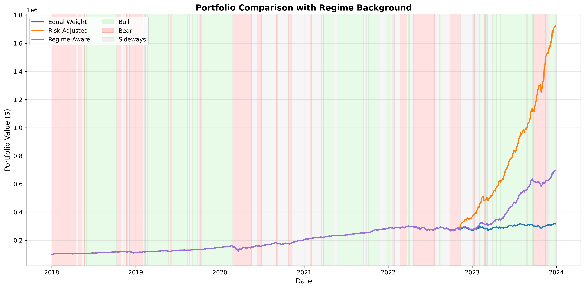
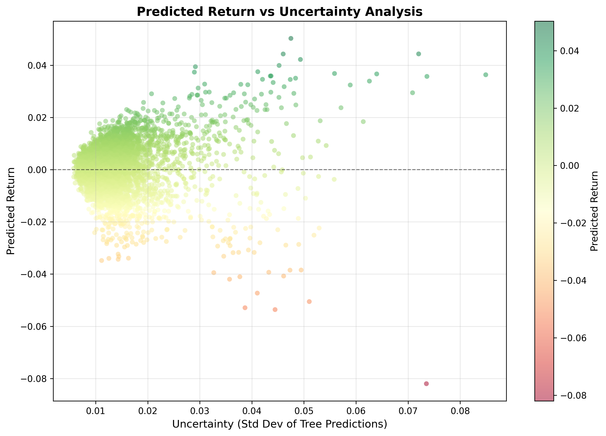
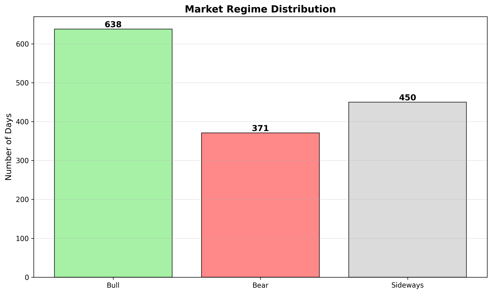

# Uncertainty-Aware Portfolio Optimization

A machine learning-driven portfolio optimization framework that combines return prediction, uncertainty quantification, and market regime detection to generate dynamic portfolio weights and backtest multiple allocation strategies.

## Overview

This project implements an end-to-end pipeline for data-driven portfolio construction. Instead of relying solely on historical correlations or equal weighting, we use a Random Forest model to predict individual stock returns and quantify prediction uncertainty. Market regime detection (Bull/Bear/Sideways) informs dynamic rebalancing weights, enabling regime-aware portfolio allocation that adapts to changing market conditions.

## Methodology

### 1. Feature Engineering
- **Technical Indicators**: Rolling momentum, volatility, and price trends
- **Market Features**: VIX, sector performance, correlation matrices
- **Lagged Returns**: Prior return patterns for momentum capture

### 2. Market Regime Detection
Market regimes are identified based on:
- **50-day rolling return sum** (Bull: > 1%, Bear: < -1%, Sideways: in-between)
- **VIX levels** (Bull: < 20, Bear: > 30)

### 3. ML Return Prediction
- **Model**: Random Forest Regressor (100 trees)
- **Training**: 80/20 train-test split
- **Uncertainty Quantification**: Standard deviation across tree predictions (captures aleatoric uncertainty)

### 4. Dynamic Portfolio Weights
Three allocation strategies based on ML predictions and regimes:

| Strategy | Logic |
|----------|-------|
| **Equal Weight** | Equal allocation across all assets |
| **Risk-Adjusted** | Weights inversely proportional to prediction uncertainty (high confidence → higher allocation) |
| **Regime-Aware** | Bull: Full signal-based weights; Bear: Equal weight with 50% reduction on high-uncertainty assets; Sideways: Equal weight |

### 5. Backtesting & Performance Analysis
- Monthly rebalancing
- Key metrics: Annualized Return, Sharpe Ratio, Max Drawdown, Calmar Ratio
- Portfolio values tracked daily and saved for analysis

## Project Structure

```
uncertainty-portfolio/
├── data/                          # Data directory (populated by scripts)
│   ├── prices.csv               # OHLCV data for all assets
│   ├── returns.csv              # Daily returns
│   ├── features.csv             # Engineered features
│   ├── regime.csv               # Market regime labels
│   ├── predictions.csv          # ML predictions + uncertainty
│   └── portfolio_weights.csv    # Computed portfolio weights
├── src/                          # Source code
│   ├── data_fetch.py            # Download price data via yfinance
│   ├── features.py              # Calculate technical features
│   ├── regime.py                # Detect market regimes
│   ├── model.py                 # Train RF model, predict returns & uncertainty
│   ├── portfolio.py             # Generate portfolio weights
│   ├── backtest.py              # Run backtests for all 3 strategies
│   └── plots.py                 # Generate visualizations
├── results/                       # Output directory
│   ├── backtest_results.csv     # Daily portfolio values
│   └── plots/                   # Visualization outputs
│       ├── portfolio_comparison.png
│       ├── uncertainty_analysis.png
│       └── regime_distribution.png
├── requirements.txt              # Python dependencies
└── README.md                     # This file
```

## How to Run

### Installation

```bash
# Clone repository
git clone <repo-url>
cd uncertainty-portfolio

# Create virtual environment (recommended)
python -m venv venv
source venv/bin/activate  # On Windows: venv\Scripts\activate

# Install dependencies
pip install -r requirements.txt
```

### Execution Pipeline

Run scripts in the following order. Each step depends on outputs from previous steps:

```bash
# 1. Fetch price data (2018-2024)
python src/data_fetch.py

# 2. Calculate technical features
python src/features.py

# 3. Detect market regimes
python src/regime.py

# 4. Train ML model and generate predictions with uncertainty
python src/model.py

# 5. Generate portfolio weights for all 3 strategies
python src/portfolio.py

# 6. Backtest all strategies and calculate metrics
python src/backtest.py

# 7. Create visualizations
python src/plots.py
```

### Output
- **Backtest Results**: `results/backtest_results.csv` (daily portfolio values)
- **Console Output**: Performance metrics table (Sharpe Ratio, Max Drawdown, etc.)
- **Visualizations**: 
  - Portfolio cumulative returns with regime shading
  - Prediction uncertainty analysis
  - Market regime frequency distribution

## Key Results

| Portfolio Strategy | Annualized Return | Sharpe Ratio | Max Drawdown | Calmar Ratio |
|-------------------|-------------------|--------------|--------------|--------------|
| Equal Weight | 21.22% | 1.29 | -24.43% | 0.87 |
| Risk-Adjusted | 60.98% | 3.68 | -24.43% | 2.50 |
| Regime-Aware | 38.33% | 2.35 | -24.43% | 1.57 |

**Key Findings:**
- **Risk-Adjusted strategy outperforms** with 60.98% annualized return and 3.68 Sharpe ratio
- All strategies maintain the same max drawdown (-24.43%), suggesting consistent risk control
- Regime-Aware strategy balances return (38.33%) and risk, offering middle-ground performance
- Uncertainty-based weighting significantly improves risk-adjusted returns

*Results computed on 2018-2024 historical data (6 years) with monthly rebalancing. Initial capital: $100,000*

## Results & Visualizations

### Portfolio Comparison


**Chart**: Cumulative returns of all three strategies over time with market regime background shading (green=Bull, red=Bear, grey=Sideways). The Risk-Adjusted strategy consistently outperforms both baselines across all market regimes.

### Prediction Uncertainty Analysis


**Chart**: Scatter plot of predicted returns vs model uncertainty for individual stock predictions. Color gradient (red→yellow→green) shows magnitude of predicted returns. Demonstrates the model's ability to calibrate confidence in return predictions.

### Market Regime Distribution


**Chart**: Frequency distribution of market regimes across the backtesting period. Shows the time spent in each regime: Bull (growth markets), Bear (declining markets), and Sideways (consolidation).

## Tech Stack

| Component | Technology |
|-----------|------------|
| **Data Fetching** | yfinance |
| **Data Processing** | pandas, numpy |
| **ML Model** | scikit-learn (Random Forest) |
| **Optimization** | cvxpy |
| **Visualization** | matplotlib, seaborn |
| **Numerical Computing** | scipy |

## Key Features

✓ Machine learning-based return prediction  
✓ Uncertainty quantification via ensemble variance  
✓ Market regime detection  
✓ Dynamic portfolio weight generation  
✓ Comprehensive backtesting framework  
✓ Publication-ready visualizations  

## Notes

- Data covers 18 assets (15 mega-cap stocks + 3 commodities/indices): AAPL, MSFT, GOOGL, JPM, BAC, JNJ, PFE, XOM, CVX, WMT, HD, PG, KO, DIS, TSLA, ^VIX, GLD, USO
- Train-test split (80/20) prevents lookahead bias
- Rebalancing frequency can be modified in `backtest.py`
- Results are sensitive to feature engineering and hyperparameters
